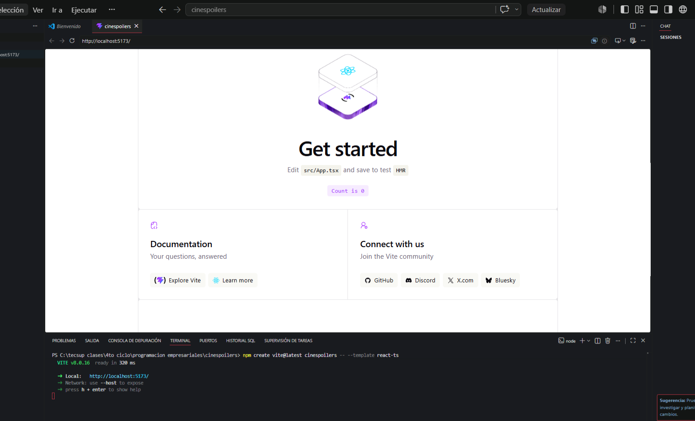
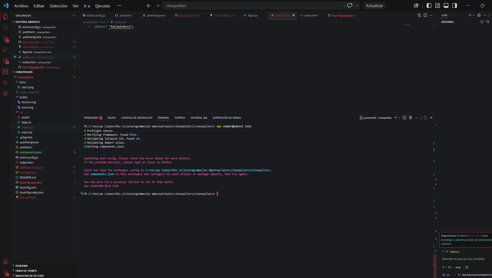
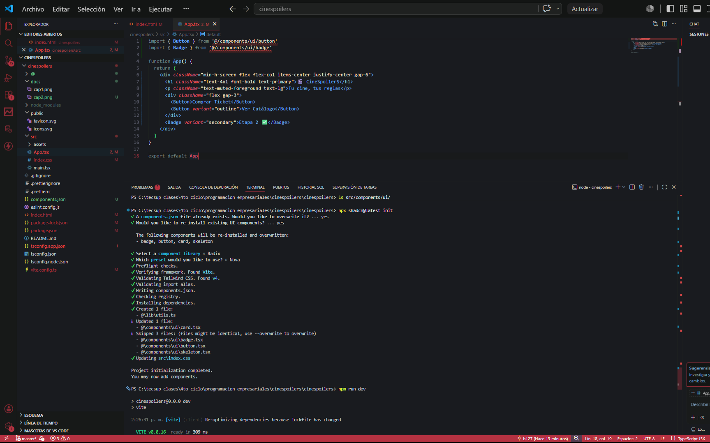
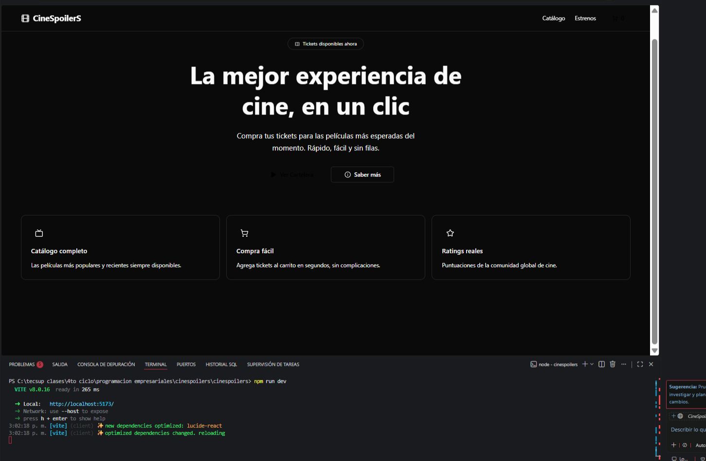

# 🎬 CineSpoilerS

E-commerce de tickets de cine construido con React + Vite + TypeScript.

## 🛠️ Stack Tecnológico

- ⚛️ React 19 + Vite
- 🟦 TypeScript
- 🎨 Tailwind CSS v4
- 🧩 shadcn/ui
- 📦 Axios

## 🚀 Instalación

```bash
git clone https://github.com/bee-17/lab13.git
cd cinespoilers
npm install
npm run dev
```

## 📸 Evidencias

### 1. Creación del proyecto con Vite + React + TypeScript


### 2. Instalación y configuración de Tailwind CSS


### 3. Instalación de shadcn/ui y componentes


### 4. Layout con Navbar usando shadcn/ui


## 📁 Estructura del Proyecto

```
src/
├── components/
│   ├── layout/    # Navbar y estructura global
│   └── ui/        # Componentes shadcn
├── pages/         # Vistas principales
├── services/      # Llamadas a la API
├── types/         # Tipos TypeScript
└── lib/           # Utilidades
```